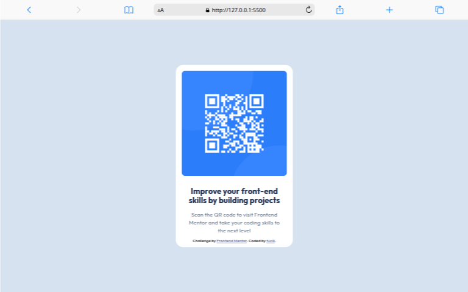

# Frontend Mentor - QR code component solution

This is a solution to the [QR code component challenge on Frontend Mentor](https://www.frontendmentor.io/challenges/qr-code-component-iux_sIO_H). Frontend Mentor challenges help you improve your coding skills by building realistic projects.

## Table of contents

- [Overview](#overview)
  - [Screenshot](#screenshot)
  - [Links](#links)
- [My process](#my-process)
  - [Built with](#built-with)
  - [What I learned](#what-i-learned)
  - [Continued development](#continued-development)
  - [Useful resources](#useful-resources)
- [Author](#author)
- [Acknowledgments](#acknowledgments)

## Overview

### Screenshot



### Links

- Solution URL: [Add solution URL here](https://github.com/tucill/qr-code-compoonent)
- Live Site URL: [Add live site URL here]()

## My process

First do git init and connect to the remote and work on the project then follow the guides and you're done.

### Built with

- Semantic HTML5 markup
- CSS custom properties
- Flexbox

### What I learned

I learned how to complete the challenge by making the QR code components as similar as possible to the design of the challenge, and this was great to increase my experience as a beginner

```html
<h1>Hi I'am tucill.</h1>
```

```css
.container {
  display: flex;
}
```

```js
const sayHi = () => {
  console.log("Hi I'am tucill");
};
```

If you want more help with writing markdown, we'd recommend checking out [The Markdown Guide](https://www.markdownguide.org/) to learn more.

### Continued development

I want to become a frontend developer who is experienced in building beautiful, responsive and interactive websites.

### Useful resources

- [Example resource 1](https://www.w3shools.com) - This really helped me learn HTML and others. There are lots of examples and documentation

## Author

- Website - [Add your name here](https://www.your-site.com)
- Frontend Mentor - [@yourusername](https://www.frontendmentor.io/profile/tucill)
- Instagram - [@tucill.xyz](https://www.instagram.com/tucill.xyz)

## Acknowledgments

I would like to thank Frontend Mentor for an amazing platform that provides exciting challenges. The challenges provided have helped me hone my coding skills and improve my understanding of building attractive interfaces.
